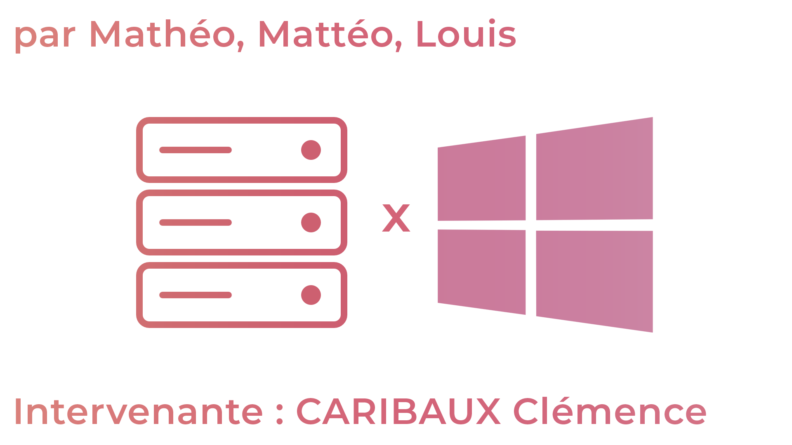

# Documentation Windows Server

----

## :books: Sommaire :

- ### [Mise en place de l'environnement](./mise-en-place/mise-en-place.md)
- ###  [TP n°1](./tp1/tp1.md)
- ###  [TP n°2](./tp2/tp2.md)
- ###  [TP n°3](./tp3/tp3.md)
- ###  [TP n°4](./tp4/tp4.md)
- ###  [TP n°5](./tp5/tp5.md)
- ###  [Conclusion](./conclu/conclusion.md)

## :hammer_and_wrench: Outils utilisés

- Utilisation de **VMWare Workstation Player** pour les machines virtuelles (et de Oracle VM **VirtualBox** pour la **Windows Server**).
- Utilisation de **GitHub** pour la documentation.

## :link: Sources

- [Créer un domaine](https://www.it-connect.fr/creer-un-domaine-ad-avec-windows-server-2016/)
