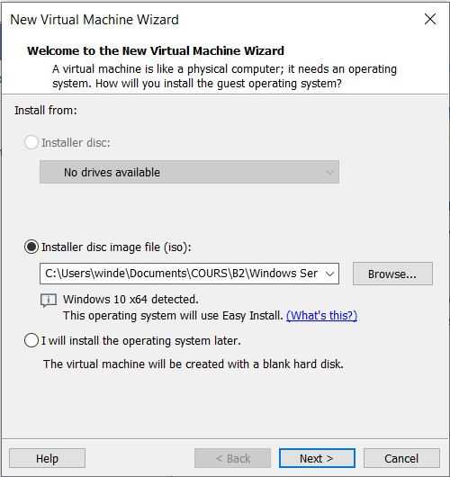

# Mise en place de l'environnement

## Récupération des ISO et des clés

Afin de mettre en place notre environnement, il nous fallait récupérer de quoi faire des VMs.

Nous avions besoin 3 VMs différentes :
- une machine sous **Windows Server**
- une machine sous **Windows 10** (Education ou Professionnel) 
- une machine sous **Linux** (Debian 11)

Pour les VM Windows Server et Windows 10, nous pouvions récuperer les clés et les ISO sur [Microsoft Azur](https://portal.azure.com/?Microsoft_Azure_Education_correlationId=622a7312-a981-4b4f-927c-a746d7804853#blade/Microsoft_Azure_Education/EducationMenuBlade/software) :

Dans la partie **Education \| Logiciels**, il fallait chercher les VMs que nous avions besoin. (Ici nous prennons l'exemple pour la VM Windows Server)

Une fois ceci fait, un onglet s'ouvre avec la possibilité de télécharger l'ISO ainsi que de copier la clé produit.

Pour **Linux (Debian 11)**, il suffit juste de récuperer un **ISO**, sur le site officiel [Debian](https://www.debian.org/download).

## Installation des VMs

Une fois tous ses éléments récupérer, il faut créer les VMs.

Il faut utiliser un logiciel pour l'installation des VMs, nous utiliserons pour l'exemple **VMWare** pour une VM Windows 10 :

Tout d'abord, on appuie sur *Create a New Virtual Machine*.

Puis, on choisi *Installer disc image file (iso)* et on chercher l'endroit de l'ISO.

Il faut ensuite mettre la **clé produit** et continuer en suivant les étapes.

Pour la **VM Linux**, il y a une différence, c'est qu'il n'y a pas de clé produit.

## Configuration réseaux des VMs.

Pour la Windows Server, il faut qu'elle soit en **Accès par Pont**.  

Les autres doivent être en **NAT**.

[<--Présentation](../README.md) | Page 1 | [TP n°1-->](../tp1/tp1.md)

