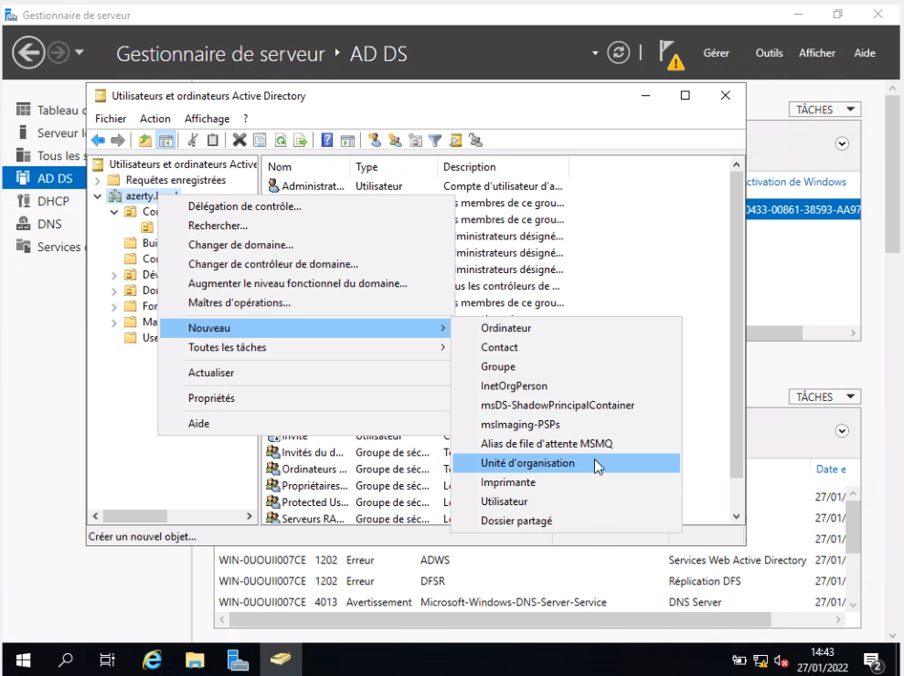
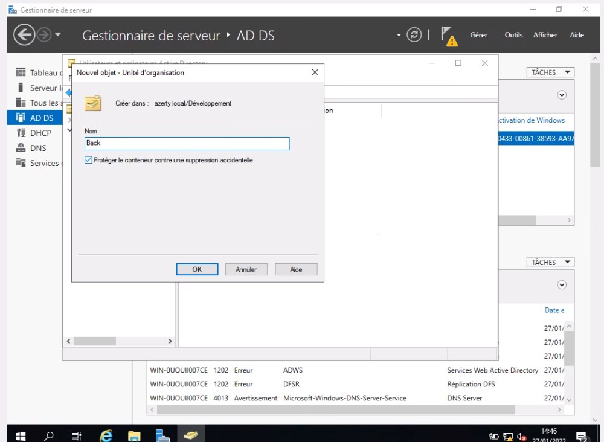
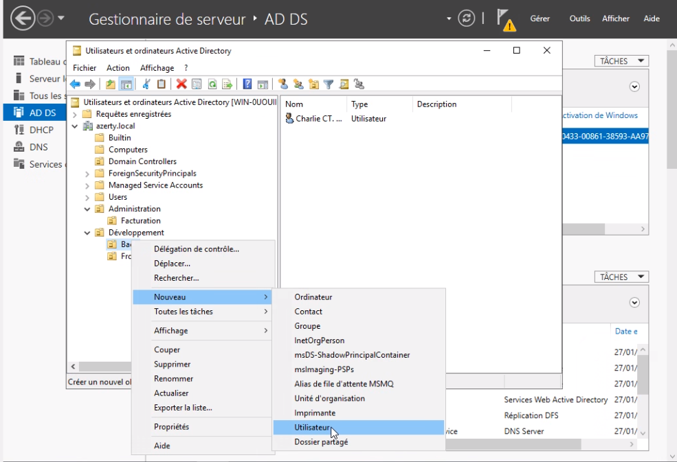
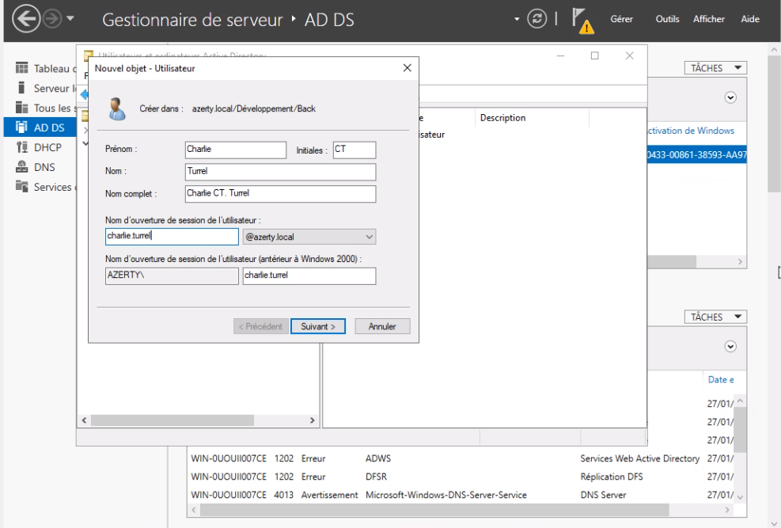

# :building_construction: TP n°1

## :clipboard: Consignes

Ici, on nous demande de :

- Créer un domaine **azerty.local**
- Créer des **OU**
- Créer manuellement un *Utilisateur* **Charlie Turrel** dans l’*OU* **Back**.
- Intégrer par **script**, le reste des *Utilisateurs* :
    - Le script **PowerShell** d’intégration vous est fournit, expliquez ce qu’il fait ligne par ligne
    - Le fichier CSV des Utilisateurs restants vous est fournit
    - Exécution du script
    - Vérification de l’ajout des Utilisateurs


## Création d'un domaine

Ici, il faut créer un domaine sous le nom de **azerty.local**.

## Création des Unité d'Organisation (OU)

> Une **unité organisationnelle** (OU) ou unité d'organisation est un **conteneur** dans un domaine Microsoft Active Directory qui peut contenir des **utilisateurs**, des **groupes** et des **ordinateurs**. - [Wikipédia](https://fr.wikipedia.org/wiki/Unit%C3%A9_organisationnelle) 


Pour créer une OU, il faut aller dans la partie *Utilisateurs et ordinateurs Active Directory*.

Une fois le menu ouvert, on fait un clique droit sur l'élément dans lequel on veut créer une OU. Puis il faut faire `Nouveau > Unité d'Organisation`



Un nouveau menu s'ouvre alors, nous permettant de choisir un nom (dans notre cas, **Back**):



## Création d'un Utilisateur

Maintenant que l'organisation est fait, il suffit de créer l'Utilisateur **Charlie Turrel** dans l'OU **Back** :




## Intégration par Script du reste des Utilisateurs

Voici le script permettant d'intégrer les autres utilisateurs :

```powershell
```


[<-- Mise en place de l'environnement](../mise-en-place/mise-en-place.md)| Page 2 | [TP n°2 -->](../tp2/tp2.md) 