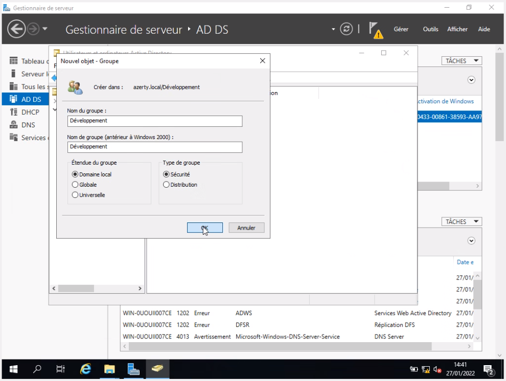
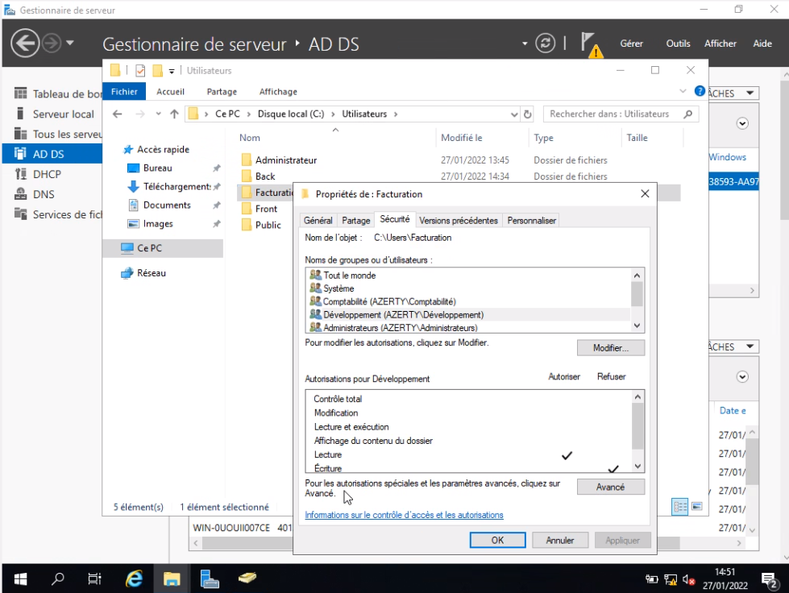
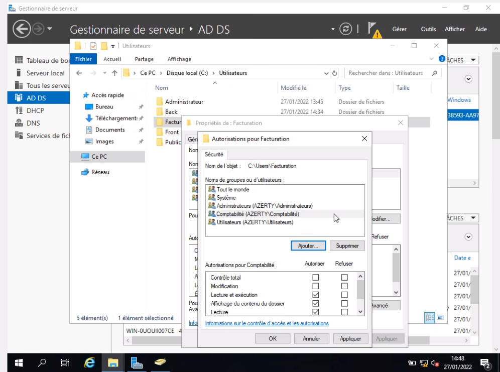
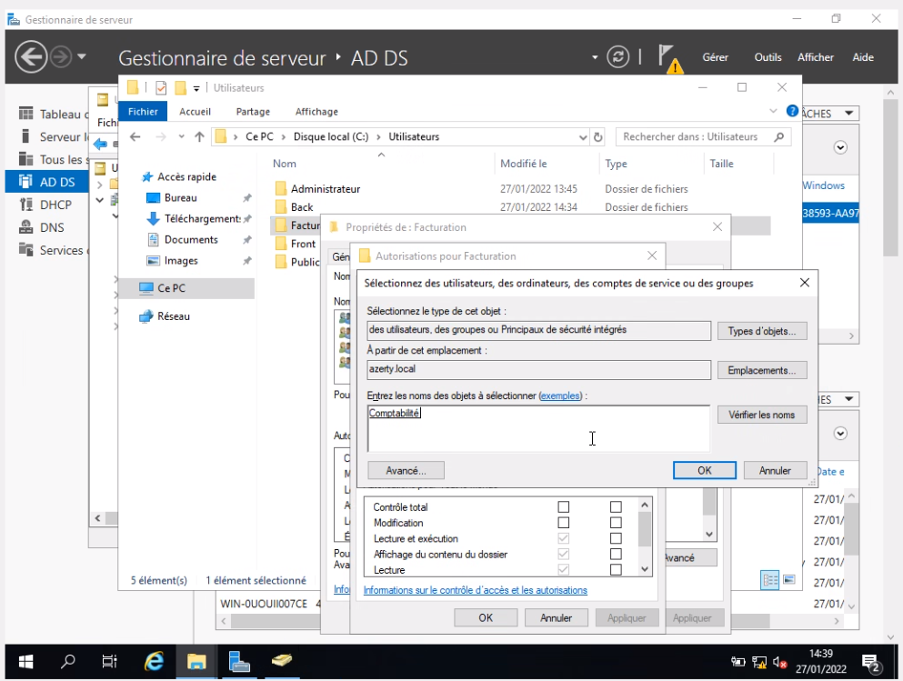

# :building_construction: TP n°2

## :clipboard: Consignes

Ici, on nous demande :

- La mise en place de **dossiers partagés** :
    - Créez les dossiers Facturation, Back et Front dans DC01.
    - Créez des groupes de sécurité correspondant aux OU, Développement et Comptabilité, mais
    aussi Facturation, Back et Front.
    - Appliquez aux dossiers les droits suivants :
        - Le service facturation ne doit pas accéder aux projets des développeurs.
        - Les développeurs peuvent accéder aux dossiers facturation en lecture seule.
- Répondez aux questions ci-dessous :
Quel répertoire dans WS est le plus sécurisé pour stocker les dossiers de la société ?

## Mise en place d'un Dossier partagé

### Création des dossiers *Facturation*, *Back*, et *Front*

On va d'abord commencer par simplement créer les trois dossiers à l'emplacement souhaité. Très simple, il suffit de faire ``clique droit > Nouveau > Dossier``.

### Création des groupes de sécurité correspondant aux OU.

Une fois ceci fait, nous allons créer les groupes de Sécurité *Développement* et *Comptabilité* ainsi que *Facturation*, *Front* et *Back*.

Ici nous créons les groupes de sécurité, directement dans les OU correspondantes.

Il faut bien mettre le nom de groupe que l'on veut (ici **Développement** pour l'OU *Développement*) ainsi que le type de groupe en `Sécurité`.

Une fois ceci fait, on va pouvoir mettre des groupes de sécurité sur les **dossiers**, afin de faire un partage bien structuré des données de ces *dossiers*.

Pour ce faire, on clique sur `Propriétés` sur le **dossier**.

Dans un premier temps, on fait en sorte de partager le dossier.

Puis dans l'onglet `Sécurité`, on va pouvoir ajouter des **Groupes de sécurité** en cliquant sur `Modifier`.

On clique ensuite sur **Ajouter**.

Ici, on recherche les groupes de sécurité que l'on veut ajouter.

Maintenant, on peut configurer les droits pour chaque groupe de sécurité :

Bien entendu il faut, pour le groupe *Facturation*, qu'il n'ait pas les droits de **lecture** (ni d'écriture/modification) sur le dossier *Développement* : **Il faut donc décocher toutes les cases**.

Pour le cas de l'équipe de **Développement**, il suffit de leur laissé les **droits de lecture** sur le dossier Facturation.

## Quel répertoire dans WS est le plus sécurisé pour stocker les dossiers de la société ?

Le répertoire dans WS qui est le plus sécurisé pour stocker les dossiers de la société est celui où seul un administrateur y a accès.

[<-- TP n°1](../tp1/tp1.md)| Page 3 | [TP n°3 -->](../tp3/tp3.md)

