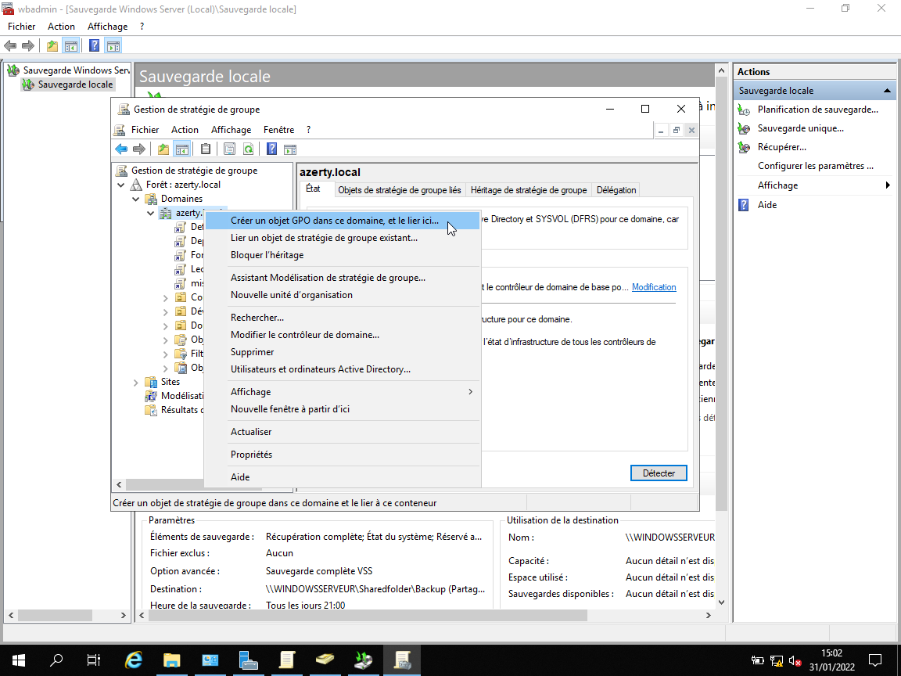

# :building_construction: TP n°3

## Définitions

``GPO`` : Group Policy Object : Ensemble de paramêtres s'appliquant à un ou plusieurs groupes de personnes.

## :clipboard: Consignes

Ici, on nous demande de faire **3 GPO** :

- **GPO 1** : **Verrouillage des écrans** après 10 min d’inactivité.
- **GPO 2** : Mise en place du **fond d’écran** de la société sur tous les postes (Image en annexe 2).
- **GPO 3** : Déployer **VirtualBox** sur tous les postes

De plus, on devait créer un **lecteur mappé**.

## Créer une GPO

Tout d'abord pour créer une gpo il faut ouvrir le menu ``Gestion des stratégies de groupe`` ici 

On peut y voir la liste des GPO actuellement créer mais aussi les différents OU ainsi que les différents utilisateurs crées. 

Pour créer une nouvelle GPO il suffit de faire clique droit et appuyer sur ``Créer un objet GPO dans ce domaine, et le lier ici`` 

Enfin il faut entrer un nom pour une nouvelle GPO 

On peut ensuite la modifier en faisant clique droit sur la GPO en question et cliquer sur modifier comme sur l'image ci dessous 

## Appliquer une GPO à un groupe d'utilisateur

Pour appliquer la GPO à un groupe d'utilisateur ici ``Dévellopement`` il faut aller sur la GPO que l'on souhaite et Ajouter un nouveau groupe d'utilisateur 
Ici par exemple on ajoute le groupe dévellopement à la GPO


A partir de la on peut effectuer les 3 gpo demander :  

## GPO 1

Pour cette première GPO on nous demandait de créer une stratégie permettant de mettre en veille les écrans après 10 minutes d'inactivité.

Pour mettre en place cette gpo il y a deux options à activer dont :  
    - ``Activer l'écran de veille`` : Permet comme son nom l'indique d'activer l'écran de veille  
    - ``Dépassement du délai d'expiration de l'écran de veille`` : Permet mettre un délai avant lequel l'écran de veille s'active  

Pour ce faire il faut tout d'abord [créer une nouvelle GPO](#créer-une-gpo)

### Activation de l'écran de veille  

Pour activer l'écran de veille il faut configurations utilisateurs => ``Stratégies`` => ``Modèles d'administration`` => ``Panneau de configuration`` => ``Personnalisation`` => ``Activer l'écran de veille``  

Cela va ouvrir la fenêtre ci-dessous et il ne reste plus qu'à activer la fonctionnalité


### Délai d'activation de l'écran de veille

Pour mettre délai sous lequel l'écran de veille s'active il faut aller dans
``configurations utilisateurs`` => ``Stratégies`` => ``Modèles d'administration`` =>
``Panneau de configuration`` => ``Personnalisation`` =>
``Dépassement du délai d'expiration de l'écran de veille`` 

Cela va ouvrir la fênetre ci-dessous et il faut modifer ces différentes options donc :
    - Activé cette fonctionalité  
    - Définir un délai avant lequel l'écran de veille s'activera  ici 600secondes(10min)


Il ne reste plus qu'à [appliuqer la GPO à un groupe d'utilisateur](#appliquer-une-gpo-à-un-groupe-dutilisateur)

## GPO 2

Pour cette GPO on nous demandait d'imposer un fond d'écran chez tout les utilisateurs.

### Création d'un dossier partager

Pour ce faire il va falloir partager un dossier qui va accueillir l'image du fond d'écran. 
Sur l'image ci-dessous je suis dans mon dossier partager ``Sharedfolder`` et dans le dossier wallapaper ou on peut y retrouver le fond d'écran qui doit être utiliser par les utilisateurs

### Activation du fond d'écran

Pour activer fond d'écran par défault il suffit d'aller dans ``configurations utilisateurs`` => ``Stratégies`` => ``Modèles d'administration`` => ``Bureau`` => ``Bureau`` => ``Papier peint du bureau``

et ensuite d'activer ces différentes options :
    - Activer la fonctionnalité
    - Ajouter le lien vers l'image du fond d'écran
cf.ci-dessous


Il ne reste plus qu'a [ajouter des utilisateurs à cette GPO](#appliquer-une-gpo-à-un-groupe-dutilisateur)

## GPO 3

Cette GPO nous demandait de déployer VirtualBox sur les postes utilisateurs.
Nous n'avons pas réussis a automatiquement déployer VirtualBox, On a juste réussi à ajouter VirtualBox à la liste des logiciels pouvant être installé manuellement par l'utilisateur [Mettre screen]

### Préparation

### Télécharger les Fichiers .msi

Il faut d'abord aller chercher les applications dans le format .msi :

- Firefox se trouve [ici](https://www.mozilla.org/fr/firefox/all/#product-desktop-release)
- Pour VirtualBox c'est un peu plus complexe il faut d'abord installer VirtualBox [ici](https://download.virtualbox.org/virtualbox/6.1.32/VirtualBox-6.1.32-149290-Win.exe)
  - Il faut ensuite exécuter cette commande ``[Nom_Du_Fichier].exe -extract`` sur l'éxécutable, cette commande créera le fichier .msi de virtualBox

### Ajouter les .msi au dossier partager

Pour permettre à l'utilisateurs de pouvoir installer les logiciels lors du démarrage pour Firefox et manuellement pour VirtualBox il faut ajouter les .msi dans le dossier partagé crée auparavant.

A la fin ca devrait ressembler à ceci   

### Ajout de la GPO

il faut tout d'abord [créer une nouvelle GPO](#créer-une-gpo)

## Déploiement Firefox

Pour déployer Firefox sur le pc d'un utilisateur il faut aller dans ``parametre ordinateurs`` => ```stratégies``` => ``Logiciel`` => ``Déployer un logiciel``

Ensuite il faut faire : ``Clique droit`` => ``ajouter un nouveau`` => ``Package``

Il ne reste plus qu'a aller chercher le .MSi disponible sur le ``Dossier Partagé`` et laissée l'option sur ``attribué``

## Déploiement virtualBox

La seul façon que l'on a trouvé pour déployer VirtualBox était d'ajouter VB dans la liste des applications que l'utilisateurs peut installer cf.ci-dessous


Pour ce faire il faut aller dans ``parametre utilisateurs`` => ```stratégies``` => ``Logiciel`` => ``Déployer un logiciel``

Ensuite il faut faire : ``Clique droit`` => ``ajouter un nouveau`` => ``Package``

Il ne reste plus qu'a aller chercher le .MSi disponible sur le ``Dossier Partagé`` et vérifier que l'option séléctionnée est ``déployer``.

Il ne reste plus qu'a [ajouter des utilisateurs à cette GPO](#appliquer-une-gpo-à-un-groupe-dutilisateur)