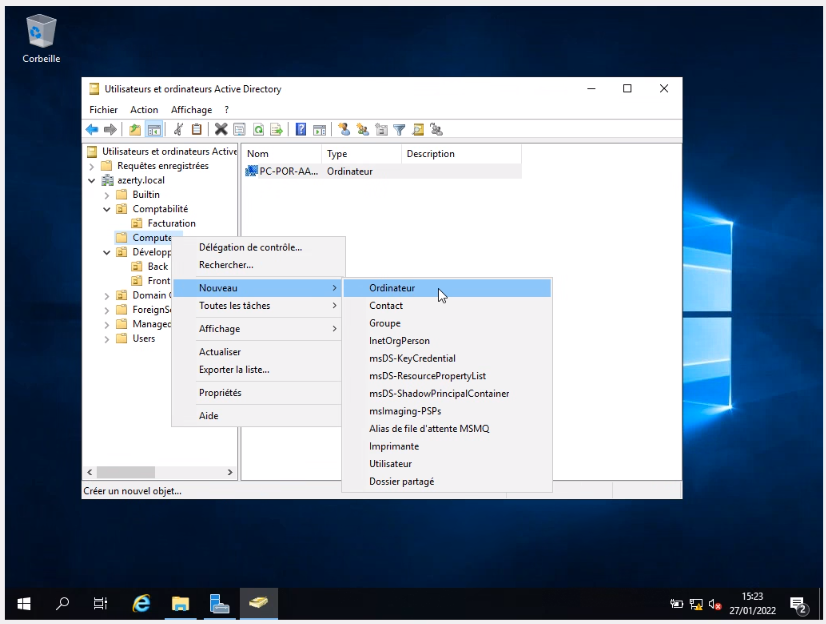
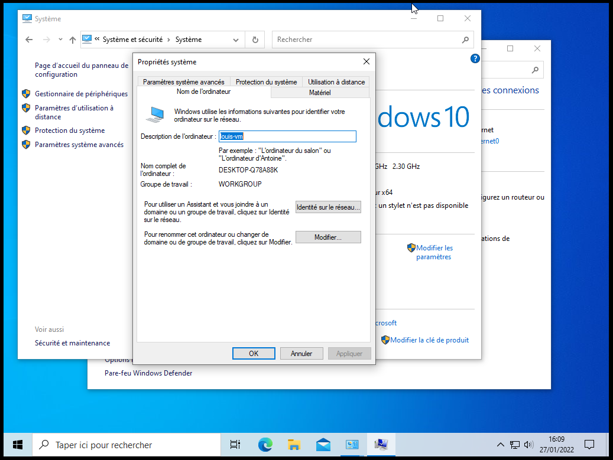
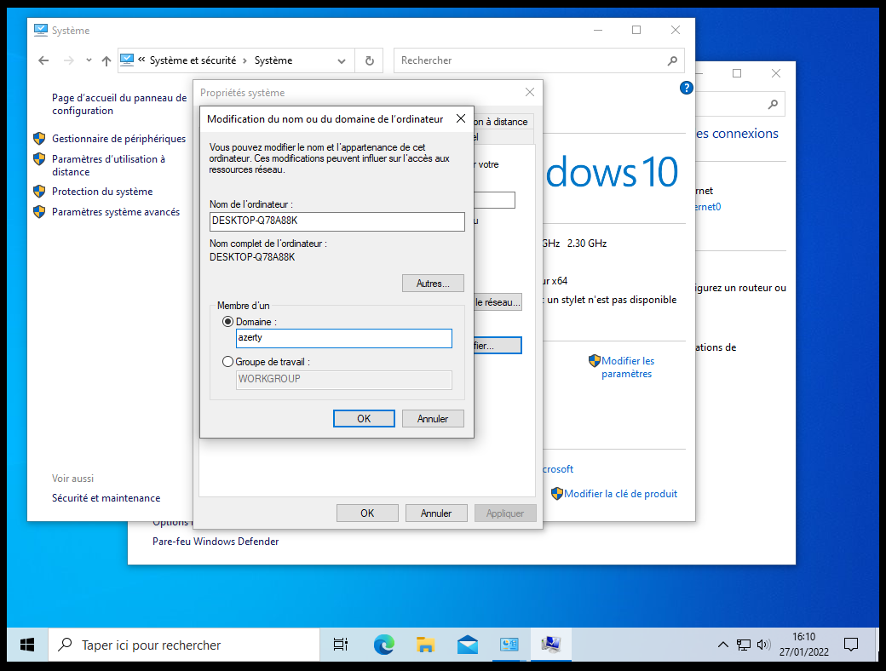
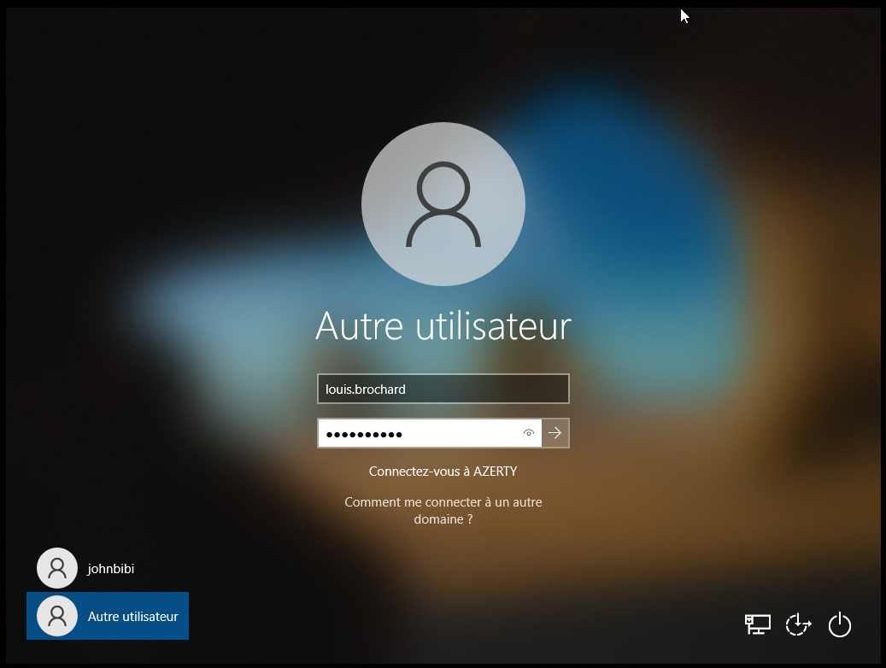
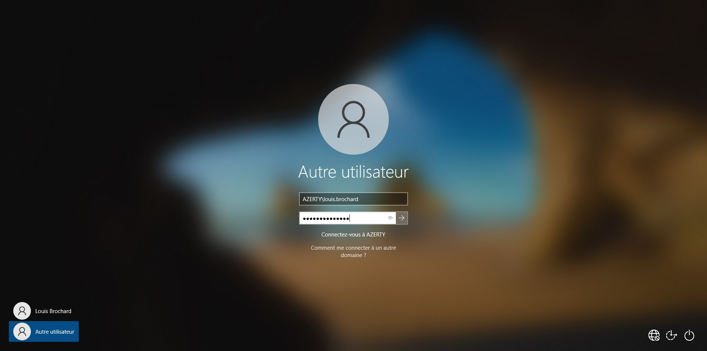
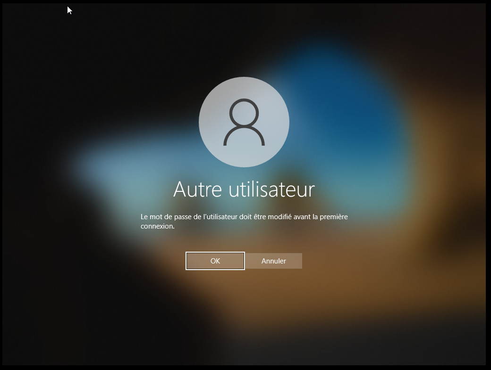

# :building_construction: TP n°4

## :clipboard: Consignes

Ici, on nous demande de faire :

- Liaison au domaine sur poste client Windows 10 :
    - Renseigner les postes dans le contrôleur de domaine en respectant la convention de
    nommage pré établies.
    - Dans le poste utilisateur, ouvrir PowerShell en tant qu’administrateur et exécutez : ``Addcomputer -Credential AZERTY\administrator -DomainName azerty.local``. Renseignez
    ensuite le mot de passe du compte Administrator.
    - Ou, réalisez la démarche suivante : Allez dans poste de travail, clic droit sur Ce PC, propriété,
    modifier les paramètres, modifier.
- Test :
    - Redémarrez le poste et connectez vous à l’aide d’un compte Utilisateur sur le domaine :
    AZERTY\nom_de_l’utilisateur
    - Testez les différentes GPO.

## Liason au domaine

### Renseignement des postes dans le contrôleur de domaine.

Pour **organiser notre Serveur** de la manière la plus propre possible, on va rentrer les **postes** dans le **contrôleur de domaine** (sur la VM Server) en respectant la **convention de nommage** suivante : ``PC-POR-XXXX`` (pour un PC portable) et ``PC-FIX-XXXX`` (pour un PC Fix). Ici, les X correspondent au numéro de série.

Pour ce faire, il faut aller dans le gestionnaire *Utilisateur et ordinateurs Active Directory*, puis dans la forêt, ajouter un Dossier `Computers`.

Une fois ceci fait, on fait un clique droit sur le dossier précédemment créé, et on fait *Nouveau > Ordinateur* :

### Faire la liaison

Une fois la machine de l'utilisateur rentré, on peut aller sur la **VM Client** et entrer le nom de domaine sur lequel est la machine.

Pour ce faire, nous devons aller dans *Panneau de configuration > Système et Sécurité > Système*. 

Puis, on clique sur *Modifier les paramètres* (si jamais, le paramètre n'est pas ici, il se peut que vous n'ayez pas une version Education ou Professionnel de votre Windows 10).

Une fois dans le menu *Propriété système* (et dans le sous-menu Nom de l'ordinateur), on peut cliquer sur le bouton Modifier (à côté du 2ème paragraphe)

Un menu s'ouvre et nous pouvons donc être membre d'un domaine.

Ici nous rentrons le nom de domaine ``azerty.local``.

## Test d'une connexion au domaine

Maintenant, on peut redémarrer la machine virtuelle et essayer de se connecter au domaine via un Utilisateur existant dans le domaine.

On entre donc le nom d'utilisateur (ici c'est la première connexion avec le compte de louis.brochard)

Il y a 2 possibilités, soit le domaine est reconnu et par conséquent, il suffit de se connecter juste comme ça.

Sinon, il faut rajouter le nom de domaine devant, ici c'est `AZERTY\nomutilisateur`

Étant la première connexion de Louis, il y a donc une demande de changement de mot de passe.

## :chart_with_upwards_trend: Axes d'améliorations

On aurait pu changer la stratégie de mot de passe, soit pour ajouter une sécurité, soit pour changer le nombre de caractère etc...

De plus, si cela est possible, on pourrait avoir un script permettant d'ajouter des mots de passe personnalisés pour chaque utilisateur (avant qu'il ne le modifie eux-mêmes).

[<-- TP n°3](../tp3/tp3.md)| Page 5 | [TP n°5 -->](../tp5/tp5.md)

