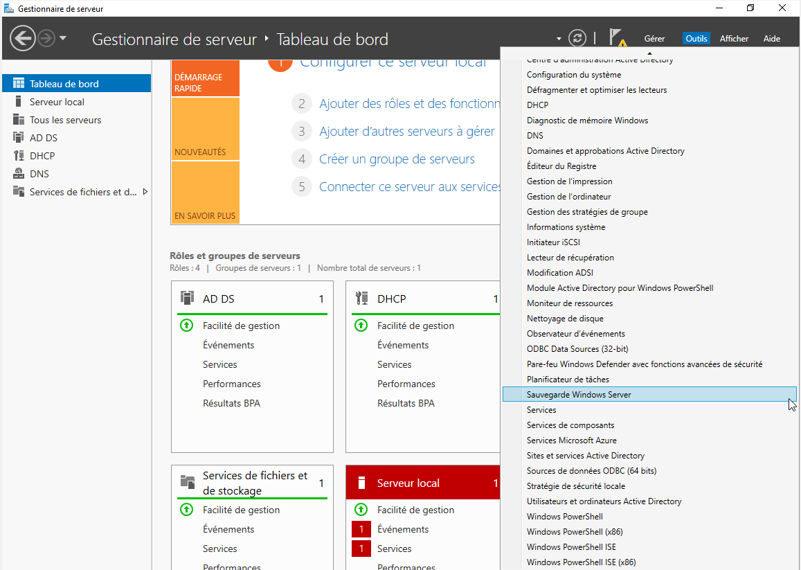
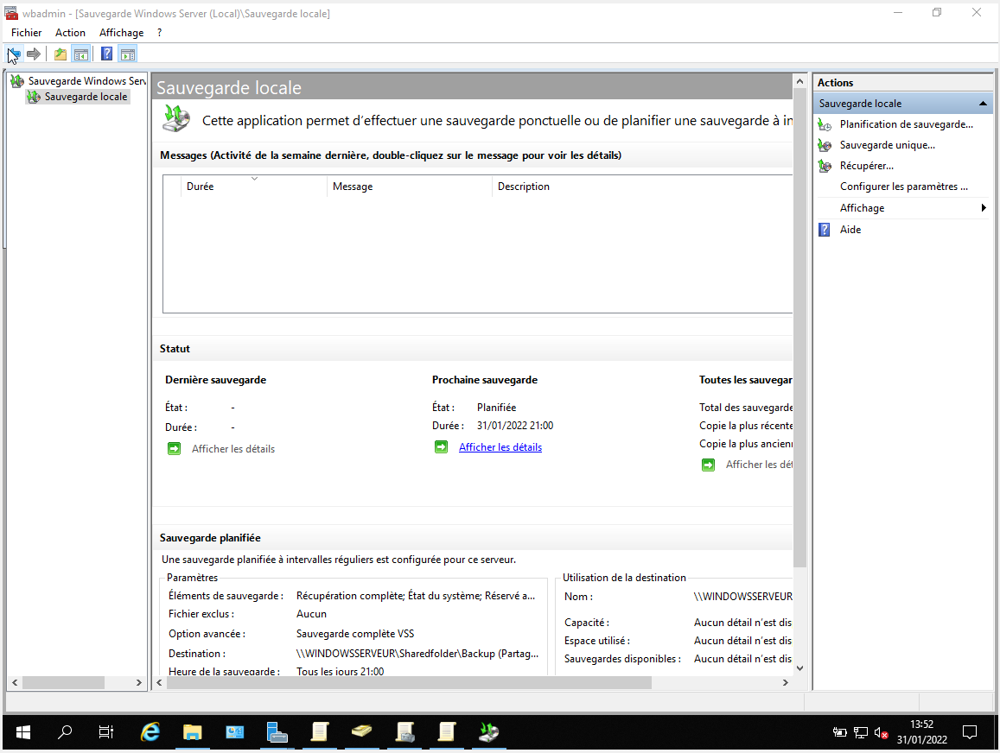
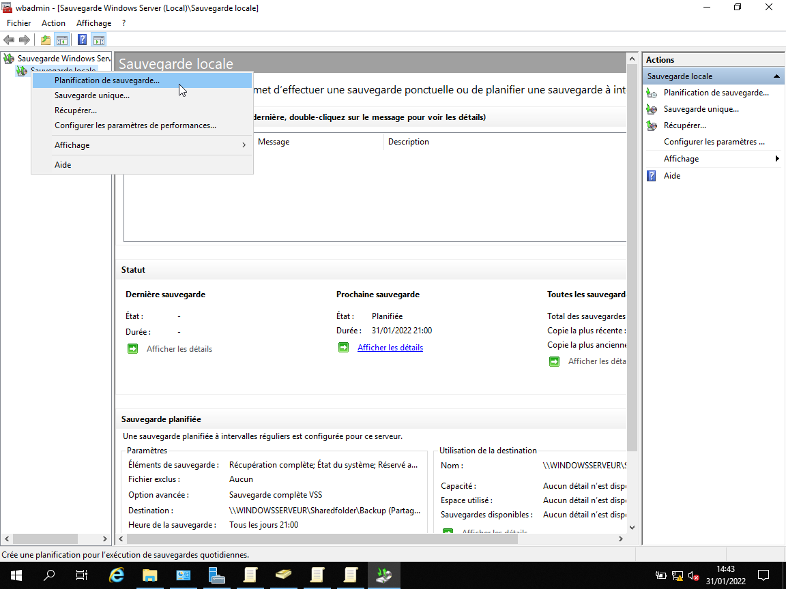
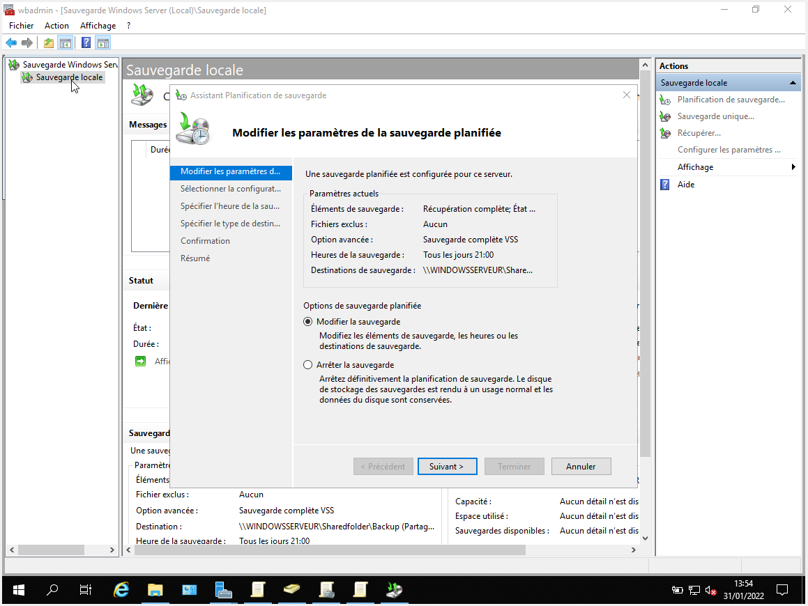
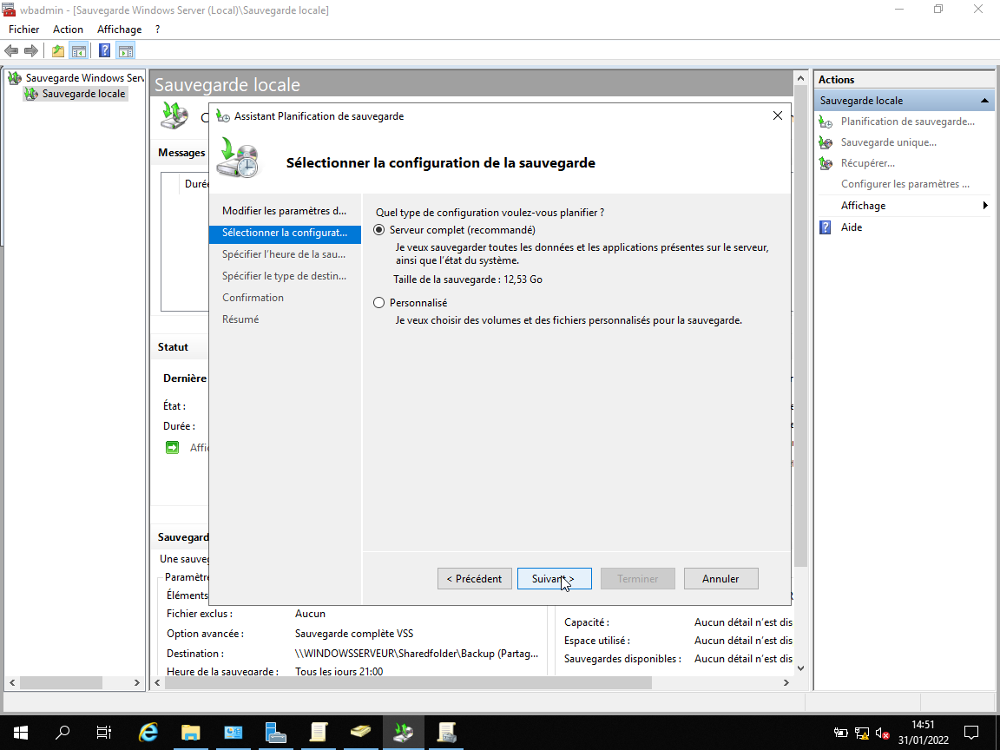
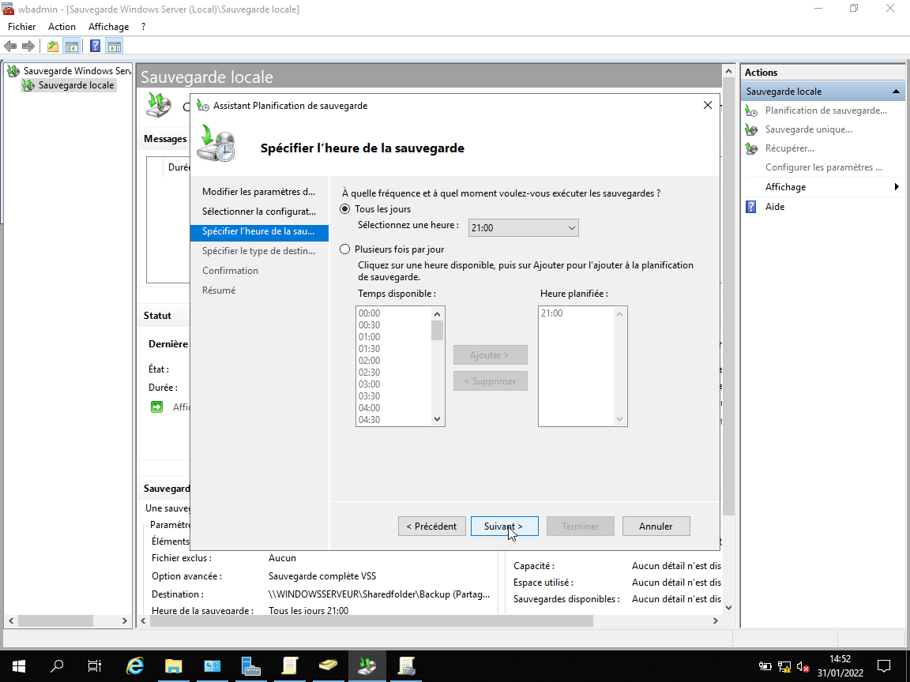
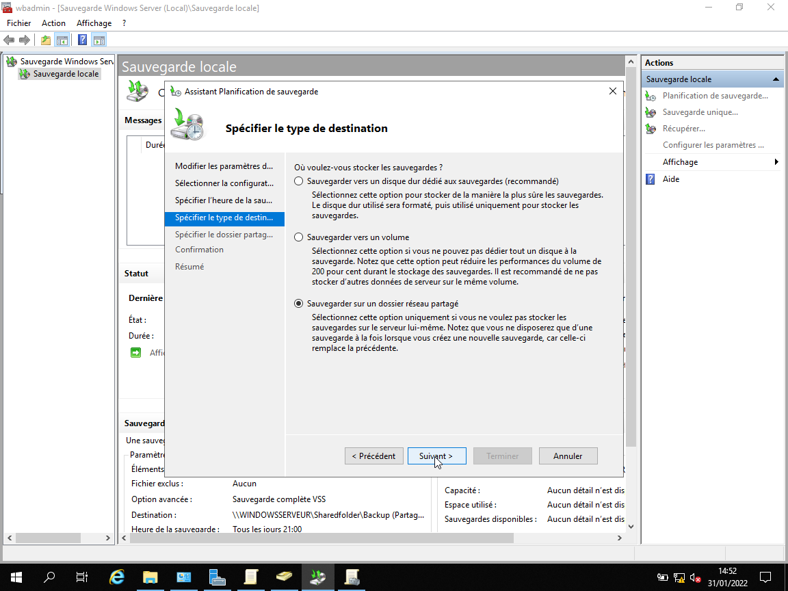
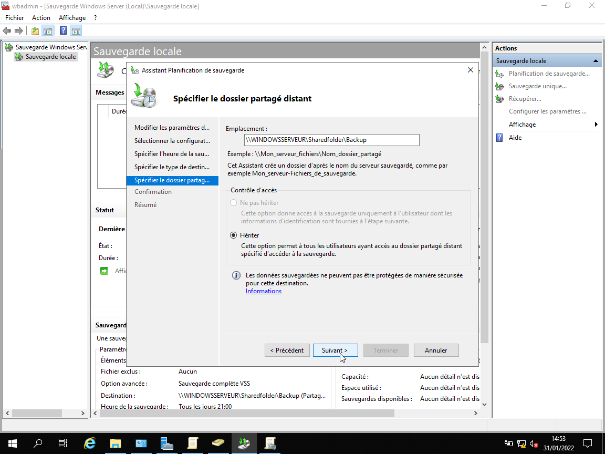
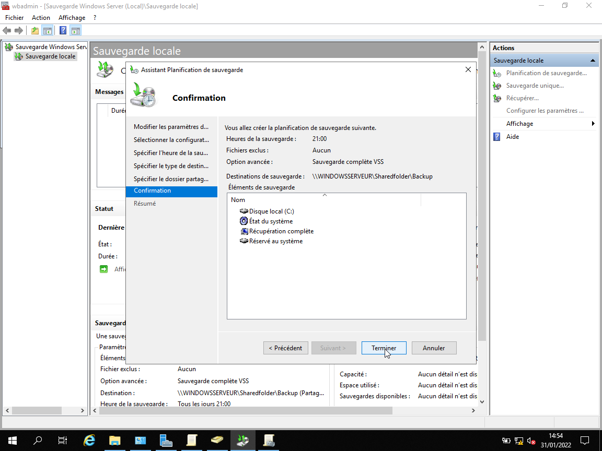

# 🏗 TP n°5

## 📋 Consignes

- Pour définir une stratégie de backup, allez dans » Ajouter des rôles et des fonctionnalités »,
cochez « Sauvegarde Windows Server », dans Outils, allez dans Sauvegarde Windows Server.
- Une fois installé, créez une « Backup Schedule » sur le serveur.
- Répondez à la question suivante :
    - Quel jour de la semaine est idéal pour programmer une sauvegarde ?

## 💾 Ouvrir la sauvegarde Windows serveur

Pour réaliser une sauvegarde de son système, dans le but d'avoir un backup, il faut tout d'abord se rendre sur son serveur, et dans les outils, sélectionner *Sauvegarde Windows Server*.

## 🕓 Créer une nouvelle planification de sauvegarde

Une fois cliqué, cet page apparait :

Pour s'occuper de notre sauvegarde, on fait un **Clic droit** sur la *Sauvegarde Locale*, et on clique sur *Planification de sauvegarde...*

## 🔧 Modifier les paramètres de la sauvegarde

Une fois fait, cette fenêtre apparaît :

Il faut vérifier que le bouton *Modifier la sauvegarde* est bien coché.

Puis on clique sur *Suivant*.

Puis on sélectionne *Serveur Complet*, afin de sauvegarder l'intégralité du serveur.

*Suivant*.

On peut ensuite sélectionner si on souhaite sauvegarder tous les jours (et à quelle heure) ou si l'on souhaite le faire plusieurs fois par jour, nous allons cliquer sur *Tous les jours* et sélectionner *21h*.

*Suivant*.

Après cela, on sélectionne où est ce que l'on enregistre cette sauvegarde, on choisit *Sauvegarder sur un dossier réseau partagé*.

*Suivant*.

Comme nous avons sélectionnés la sauvegarde sur un réseau partagé, il faut maintenant choisir sur quel dossier partagé enregistrer la sauvegarde.
On entre l'emplacement du dossier, et on appuie sur *Suivant*.

Apparaît maintenant une page de confirmation pour vérifier tous vos paramètres. Une fois qu'ils sont vérifiés, vous pouvez appuyer sur *Terminer*.

Et voilà pour le TP5.
